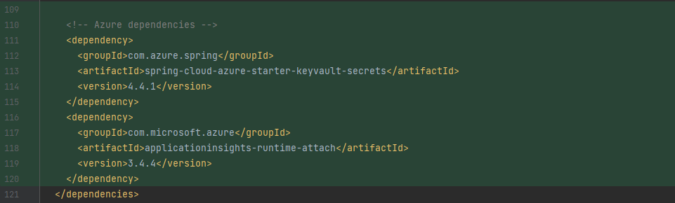
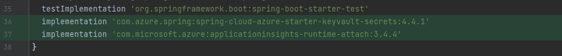
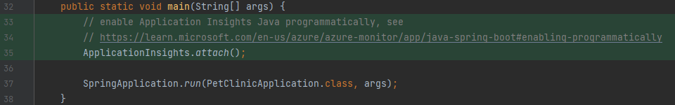
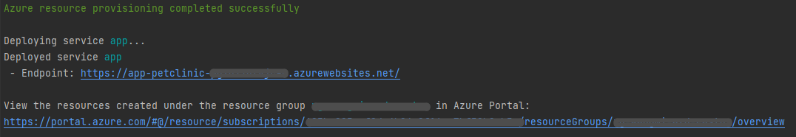
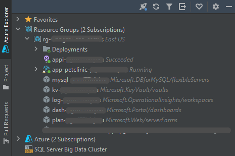

# [Spring PetClinic Sample Application](https://github.com/spring-projects/spring-petclinic) using a full set of Azure solutions

* [Azure AppService](https://azure.microsoft.com/en-us/products/app-service/) for app hosting,
* [Azure Database for MySQL](https://azure.microsoft.com/en-us/products/mysql/) for storage,
* [Azure Monitor](https://azure.microsoft.com/en-us/products/monitor/)([Application Insights](https://learn.microsoft.com/en-us/azure/azure-monitor/app/app-insights-overview?tabs=net)) for monitoring and logging.
* [Key Vault](https://azure.microsoft.com/en-us/products/key-vault/) for securing secret/password.

This application uses the [Azure Developer CLI (azd)](https://learn.microsoft.com/en-us/azure/developer/azure-developer-cli/overview)
to get you up and running on Azure quickly.

## Diff from the original Spring PetClinic 
diff from [9ecdc111](https://github.com/spring-projects/spring-petclinic/commit/9ecdc1111e3da388a750ace41a125287d9620534)

* `./infra` and `./azure.yaml`: application "infrastructure as code" files to create and configure Azure resources.
* `./pom.xml` and `./build.gradle`: import required libraries for `Azure Key Vault`/`Azure Monitor`(`Azure Application Insights`) integration.
    * `pom.xml`
      
    * `build.gradle`
      
* `./src/main/resources/application-azure.properties`: enable importing KeyVault secrets(`MySQL` user password) as properties.
  see [Configurable properties of Key Vault Secret PropertySource](https://microsoft.github.io/spring-cloud-azure/current/reference/html/index.html#all-configurable-properties)
  ```properties
    # Import KeyVault secrets as properties
    spring.cloud.azure.keyvault.secret.property-sources[0].enabled=true
    spring.cloud.azure.keyvault.secret.property-sources[0].endpoint=${AZURE_KEY_VAULT_ENDPOINT}
  ```
* `./src/main/java/org/springframework/samples/petclinic/PetClinicApplication.java`: enable monitoring and logging with `Azure Application Insights`
  

## Prerequisites

The following prerequisites are required to use this application. Please ensure that you have them all installed locally.

* [Azure Developer CLI](https://learn.microsoft.com/en-us/azure/developer/azure-developer-cli/install-azd)
* Java 8 or later

## Quickstart

The fastest way for you to get this application up and running on Azure is to use the `azd up` command. This single command will create
and configure all necessary Azure resources - including access policies and roles for your account and service-to-service communication
with Managed Identities.

1. Open a terminal, create a new empty folder, and change into it.
2. Run the following command to initialize the project, provision Azure resources, and deploy the application code.

```bash
azd up --template spring-petclinic-java-mysql
```

You will be prompted for the following information:

- `Environment Name`: This will be used as a prefix for the resource group that will be created to hold all Azure resources. This name
- should be unique within your Azure subscription.
- `Azure Location`: The Azure location where your resources will be deployed.
- `Azure Subscription`: The Azure Subscription where your resources will be deployed.

> This template will create infrastructure and deploy code to Azure. If you don't have an Azure Subscription, you can sign up for
> a [free account here](https://azure.microsoft.com/free/). Make sure you have contributor role to the Azure subscription.

> NOTE: This may take a while to complete as it executes three commands: `azd init` (initializes environment), `azd provision`
> (provisions Azure resources), and `azd deploy` (deploys application code). You will see a progress indicator as it provisions and
> deploys your application.

When `azd up` is complete it will output the following URLs:

- Spring PetClinic Web application endpoint
- Azure Portal link to view resources



You can also manage the created resources directly in `Azure Explorer` if you use `IntelliJ IDEA` and installed 
[`Azure Toolkit for IntelliJ`](https://plugins.jetbrains.com/plugin/8053-azure-toolkit-for-intellij) for it



Click the web application URL to launch the ToDo app. Create a new collection and add some items. This will create monitoring activity
in the application that you will be able to see later when you run `azd monitor`.

> NOTE:
>
> - The `azd up` command will create Azure resources that will incur costs to your Azure subscription. You can clean up those resources
> manually via the Azure portal or with the `azd down` command.
> - You can call `azd up` as many times as you like to both provision and deploy your solution, but you only need to provide the
> - `--template` parameter the first time you call it to get the code locally. Subsequent `azd up` calls do not require the template
> - parameter. If you do provide the parameter, all your local source code will be overwritten if you agree to overwrite when prompted.
> - You can always create a new environment with `azd env new`.

### Additional azd commands

The Azure Developer CLI includes many other commands to help with your Azure development experience.
You can view these commands at the terminal by running azd help. You can also view the full list of
commands on our [Azure Developer CLI command](https://aka.ms/azure-dev/ref) page.

## Run application locally

To run this application locally with Azure solutions, you need to pass the environment variables below to the application first. Values of these
environment variables are all available in the `.azure/${Environment-Name}/.env` file if `azd provision` or `azd up ...` completes successfully.

```properties
# activate `azure` and `mysql` spring profiles
SPRING_PROFILES_ACTIVE=azure,mysql
# Azure Application Insights connection string, for monitoring and logging
APPLICATIONINSIGHTS_CONNECTION_STRING=...
# Azure Key Vault endpoint, where the MySQL user password (${MYSQL_PASS}) is stored
AZURE_KEY_VAULT_ENDPOINT=...
# Azure Database for MySQL server jdbc url
MYSQL_URL=...
# Azure Database for MySQL server user name
MYSQL_USER=...
```
## Security

### Roles

This template creates a [managed identity](https://docs.microsoft.com/azure/active-directory/managed-identities-azure-resources/overview)
for your app inside your Azure Active Directory tenant, and it is used to authenticate your app with Azure and other services
that support Azure AD authentication like Key Vault via access policies. You will see principalId referenced in the infrastructure
as code files, that refers to the id of the currently logged in Azure CLI user, which will be granted access policies and permissions
to run the application locally. To view your managed identity in the Azure Portal, follow these
[steps](https://docs.microsoft.com/azure/active-directory/managed-identities-azure-resources/how-to-view-managed-identity-service-principal-portal).

### Key Vault

This template uses [Azure Key Vault](https://docs.microsoft.com/azure/key-vault/general/overview) to securely store user password
for the provisioned Azure Database for MySQL flexible server. Key Vault is a cloud service for securely storing and accessing secrets
(API keys, passwords, certificates, cryptographic keys) and makes it simple to give other Azure services access to them. As you
continue developing your solution, you may add as many secrets to your Key Vault as you require.


## Credits

This Spring microservices sample is forked from
[spring-projects/spring-petclinic](https://github.com/spring-projects/spring-petclinic) - see [Petclinic README](./README-petclinic.md).

## Contributing

This project welcomes contributions and suggestions.  Most contributions require you to agree to a
Contributor License Agreement (CLA) declaring that you have the right to, and actually do, grant us
the rights to use your contribution. For details, visit https://cla.opensource.microsoft.com.

When you submit a pull request, a CLA bot will automatically determine whether you need to provide
a CLA and decorate the PR appropriately (e.g., status check, comment). Simply follow the instructions
provided by the bot. You will only need to do this once across all repos using our CLA.

This project has adopted the [Microsoft Open Source Code of Conduct](https://opensource.microsoft.com/codeofconduct/).
For more information see the [Code of Conduct FAQ](https://opensource.microsoft.com/codeofconduct/faq/) or
contact [opencode@microsoft.com](mailto:opencode@microsoft.com) with any additional questions or comments.
